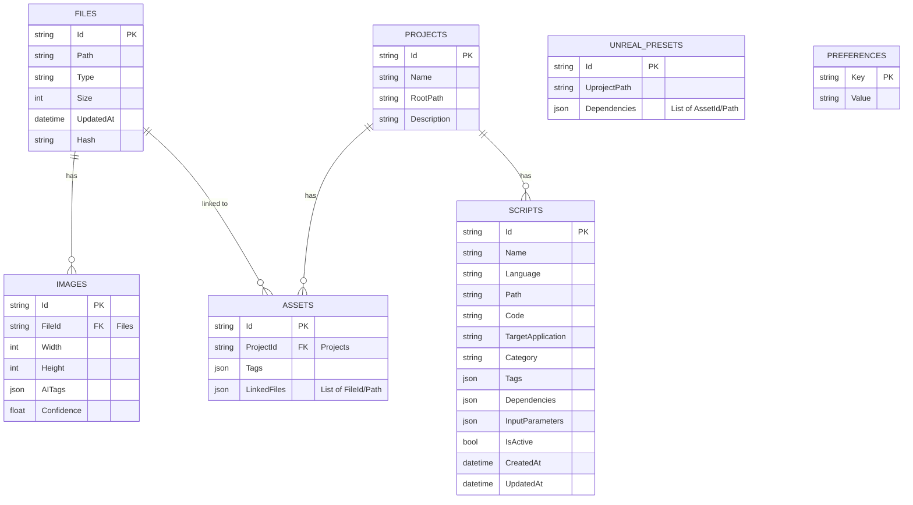

# 📊 Data Structure

このドキュメントでは、Pivotアプリケーションの主要なデータモデル、エンティティ、およびスキーマについて説明します。

## 1. Database Schema with ER Diagram

要件定義書で提示されたテーブル構成を基に、ER図を作成します。



## 2. API Input/Output Data Structures

### 2.1 AI分類結果 (JSON)

`AIClassifierService.AnalyzeAsync` からの出力は、以下のJSON形式を想定しています。

```json
[
  {
    "filePath": "/path/to/image1.png",
    "predictions": [
      { "category": "Texture", "confidence": 0.98 },
      { "category": "Material", "confidence": 0.85 }
    ]
  },
  {
    "filePath": "/path/to/image2.jpg",
    "predictions": [
      { "category": "ConceptArt", "confidence": 0.95 },
      { "category": "Reference", "confidence": 0.70 }
    ]
  }
]
```

### 2.2 SyncService (API連携)

**プロジェクト情報 (POST /projects)**

```json
{
  "id": "guid-string",
  "name": "My Game Project",
  "rootPath": "D:/Projects/MyGame",
  "description": "Description of my game project."
}
```

**WIP情報 (POST /wip)**

```json
{
  "projectId": "guid-string",
  "assetId": "guid-string",
  "progress": 0.75,
  "notes": "Working on character model textures."
}
```

### 2.3 Scripts テーブル スキーマ

**Scriptsテーブル詳細定義**

Scriptsテーブルは、VEX、Python、PyMEL、C++ など複数のスクリプト言語に対応しており、以下の属性を持ちます：

| フィールド名 | 型 | 説明 | 必須 | インデックス |
|---|---|---|---|---|
| Id | int (Auto PK) | スクリプト ID | ✓ | Primary Key |
| Name | string | スクリプトの名前（例: "MayaRigBuilder"） | ✓ | ✗ |
| Language | string | スクリプト言語（VEX, Python, PyMEL, C++, Lua など） | ✓ | ✓ (Non-unique) |
| Path | string | スクリプトファイルの絶対パス | ✓ | ✓ (Unique) |
| CodeContent | string | スクリプトコードの内容（またはコード内容のハッシュ値） | ✓ | ✗ |
| Hash | string | コードのハッシュ値（変更検知用） | ✗ | ✗ |
| TargetApplication | string | 対応アプリケーション（Houdini, Maya, Blender, UnrealEngine, Substance など） | ✓ | ✓ (Non-unique) |
| Version | string | スクリプトのバージョン（デフォルト: "1.0.0"） | ✓ | ✗ |
| Description | string | スクリプトの説明・ドキュメント | ✗ | ✗ |
| Category | string | スクリプトの分類（Rigging, Animation, DataProcessing, Utility など） | ✗ | ✓ (Non-unique) |
| TagsJson | string (JSON) | スクリプトのタグ（JSON配列） | ✓ (Default: []) | ✗ |
| DependenciesJson | string (JSON) | スクリプトが依存する他のスクリプト ID のリスト（JSON配列） | ✓ (Default: []) | ✗ |
| InputParametersJson | string (JSON) | スクリプトの入力パラメータ定義（JSON配列） | ✓ (Default: []) | ✗ |
| IsExecutable | bool | スクリプトが実行可能かどうかのフラグ | ✓ (Default: false) | ✗ |
| IsActive | bool | スクリプトが有効かどうかのフラグ | ✓ (Default: true) | ✗ |
| Size | long | ファイルサイズ（バイト） | ✗ | ✗ |
| CreatedAt | datetime | スクリプト作成日時 | ✓ | ✗ |
| UpdatedAt | datetime | スクリプト更新日時 | ✓ | ✗ |
| Author | string | スクリプト作成者 | ✗ | ✗ |

**例: Script エントリの JSON 表現**

```json
{
  "id": 1,
  "name": "MayaRigBuilder",
  "language": "PyMEL",
  "path": "D:/Scripts/Maya/RigBuilder.py",
  "codeContent": "import pymel.core as pm\n...",
  "hash": "a1b2c3d4e5f6g7h8",
  "targetApplication": "Maya",
  "version": "2.1.0",
  "description": "Advanced rig building automation for Maya",
  "category": "Rigging",
  "tagsJson": ["automation", "rig", "maya", "production"],
  "dependenciesJson": [3, 5],
  "inputParametersJson": [
    {
      "name": "characterName",
      "type": "string",
      "required": true,
      "description": "Name of the character to rig"
    },
    {
      "name": "numberOfBones",
      "type": "int",
      "required": false,
      "default": 50,
      "description": "Number of bones in the rig"
    }
  ],
  "isExecutable": true,
  "isActive": true,
  "size": 15247,
  "createdAt": "2025-01-15T10:30:00Z",
  "updatedAt": "2025-03-10T14:50:00Z",
  "author": "TechArtist01"
}
```

**例: Houdini VEX スクリプト エントリ**

```json
{
  "id": 2,
  "name": "GeoProcessing_VEX",
  "language": "VEX",
  "path": "D:/Scripts/Houdini/geo_processing.vex",
  "codeContent": "// VEX code for geometry processing\n...",
  "hash": "f7e6d5c4b3a2z1y0",
  "targetApplication": "Houdini",
  "version": "1.5.2",
  "description": "Optimized geometry processing with advanced deformations",
  "category": "DataProcessing",
  "tagsJson": ["geometry", "deformation", "optimization", "houdini"],
  "dependenciesJson": [],
  "inputParametersJson": [
    {
      "name": "deformation_strength",
      "type": "float",
      "required": true,
      "default": 1.0,
      "description": "Strength of deformation"
    }
  ],
  "isExecutable": true,
  "isActive": true,
  "size": 8942,
  "createdAt": "2024-11-20T09:15:00Z",
  "updatedAt": "2025-02-28T16:45:00Z",
  "author": "HDGeoSpecialist"
}
```

**例: C++ (Unreal Engine 用) スクリプト エントリ**

```json
{
  "id": 3,
  "name": "CustomActorPlugin",
  "language": "C++",
  "path": "D:/UnrealProjects/Plugins/CustomActors/Source/CustomActors/Public/CustomActor.h",
  "codeContent": "#pragma once\n#include \"GameFramework/Actor.h\"\n...",
  "hash": "z0y1x2w3v4u5t6s7",
  "targetApplication": "UnrealEngine",
  "version": "4.2.1",
  "description": "Custom actor classes for extended gameplay functionality",
  "category": "Utility",
  "tagsJson": ["unreal", "plugin", "gameplay", "c++"],
  "dependenciesJson": [],
  "inputParametersJson": [],
  "isExecutable": false,
  "isActive": true,
  "size": 42156,
  "createdAt": "2025-01-01T12:00:00Z",
  "updatedAt": "2025-03-05T11:20:00Z",
  "author": "GameplayProgrammer"
}
```

### 2.4 UnrealPresets テーブル スキーマ

**UnrealPresetsテーブル詳細定義**

UnrealPresetsテーブルは、Unreal Engineのシーンプリセット情報を管理するテーブルです。
BridgeSystem経由でUnreal Engineから受信するプリセット情報や、Pivot内で管理するUnreal連携プリセットを保持します。

| フィールド名 | 型 | 説明 | 必須 | インデックス |
|---|---|---|---|---|
| Id | int (Auto PK) | プリセット ID | ✓ | Primary Key |
| Name | string | プリセットの名前（例: "CharacterLighting_Day"） | ✓ | ✓ (Non-unique) |
| UprojectPath | string | プリセットが関連する .uproject ファイルのパス | ✓ | ✓ (Non-unique) |
| ProjectName | string | 対応するUnreal Engineプロジェクト名 | ✓ | ✓ (Non-unique) |
| Description | string | プリセットの説明・ドキュメント | ✗ | ✗ |
| Category | string | プリセットの分類（Lighting, Camera, PostProcess, Landscape, Animation など） | ✗ | ✓ (Non-unique) |
| TagsJson | string (JSON) | プリセットのタグ（JSON配列） | ✓ (Default: []) | ✗ |
| PresetDataJson | string (JSON) | プリセットの実際のデータ内容（UnrealのシーンプロパティをJSON化） | ✓ (Default: {}) | ✗ |
| DependenciesJson | string (JSON) | このプリセットが依存するアセット/スクリプト/プリセットのIDリスト（JSON） | ✓ (Default: {}) | ✗ |
| Version | string | プリセットのバージョン（デフォルト: "1.0.0"） | ✓ | ✗ |
| IsActive | bool | プリセットが有効かどうかのフラグ | ✓ (Default: true) | ✗ |
| IsCompatible | bool | プリセットがUnreal Engine内で適用可能かどうか（互換性チェック用） | ✓ (Default: true) | ✗ |
| Hash | string | プリセットファイルのハッシュ値（変更検知用） | ✗ | ✗ |
| EngineVersion | string | Unrealプロジェクトのエンジンバージョン（例: "5.3", "5.4"） | ✗ | ✗ |
| Author | string | プリセット作成者 | ✗ | ✗ |
| CreatedAt | datetime | プリセット作成日時 | ✓ | ✗ |
| UpdatedAt | datetime | プリセット更新日時 | ✓ | ✗ |
| LastSyncedAt | datetime? | 最後にUnrealに同期された日時 | ✗ | ✗ |

**例: Lighting プリセット エントリ**

```json
{
  "id": 1,
  "name": "CharacterLighting_Day",
  "uprojectPath": "D:/UnrealProjects/MyGame/MyGame.uproject",
  "projectName": "MyGame",
  "description": "Optimized lighting setup for day scenes with character focus",
  "category": "Lighting",
  "tagsJson": ["character", "day", "outdoor", "production"],
  "presetDataJson": {
    "directionalLight": {
      "intensity": 3.5,
      "color": [1.0, 0.95, 0.9],
      "rotation": {"yaw": 45, "pitch": 60, "roll": 0}
    },
    "skyLight": {
      "intensity": 1.2,
      "castShadows": true
    },
    "postProcessing": {
      "exposure": {
        "metering": "Average",
        "compensation": 0.2
      },
      "colorGrading": {
        "saturation": [1.1, 1.0, 0.95],
        "contrast": [1.05, 1.05, 1.0]
      }
    }
  },
  "dependenciesJson": {
    "assets": [5, 12],
    "scripts": [],
    "presets": []
  },
  "version": "2.0.1",
  "isActive": true,
  "isCompatible": true,
  "hash": "a1b2c3d4e5f6g7h8",
  "engineVersion": "5.4",
  "author": "LightingDirector",
  "createdAt": "2024-12-01T10:00:00Z",
  "updatedAt": "2025-03-10T14:30:00Z",
  "lastSyncedAt": "2025-03-10T14:30:00Z"
}
```

**例: Camera プリセット エントリ**

```json
{
  "id": 2,
  "name": "CameraFly_Cinematic",
  "uprojectPath": "D:/UnrealProjects/MyGame/MyGame.uproject",
  "projectName": "MyGame",
  "description": "Smooth flying camera preset for cinematic sequences",
  "category": "Camera",
  "tagsJson": ["cinematic", "smooth", "fly-through", "animation"],
  "presetDataJson": {
    "camera": {
      "fov": 45,
      "focusDistance": 1000,
      "aperture": 2.0,
      "motionBlur": {
        "enabled": true,
        "amount": 0.5
      }
    },
    "cameraMovement": {
      "speed": 5000,
      "acceleration": 2000,
      "smoothing": 0.8
    }
  },
  "dependenciesJson": {
    "assets": [],
    "scripts": [3, 7],
    "presets": []
  },
  "version": "1.3.0",
  "isActive": true,
  "isCompatible": true,
  "hash": "z9y8x7w6v5u4t3s2",
  "engineVersion": "5.4",
  "author": "DirectorOfPhotography",
  "createdAt": "2025-01-15T09:00:00Z",
  "updatedAt": "2025-02-28T16:20:00Z",
  "lastSyncedAt": "2025-02-28T16:20:00Z"
}
```

**例: PostProcess プリセット エントリ**

```json
{
  "id": 3,
  "name": "PostProcess_NightmareMode",
  "uprojectPath": "D:/UnrealProjects/MyGame/MyGame.uproject",
  "projectName": "MyGame",
  "description": "Dark, intense post-processing for horror/nightmare sequences",
  "category": "PostProcess",
  "tagsJson": ["horror", "dark", "intense", "atmosphere"],
  "presetDataJson": {
    "colorGrading": {
      "saturation": [0.6, 0.5, 0.8],
      "contrast": [1.3, 1.2, 1.1],
      "highlights": {
        "red": 0.8,
        "green": 0.7,
        "blue": 1.2
      }
    },
    "toneCurve": {
      "enabled": true,
      "intensity": 0.9
    },
    "vignette": {
      "intensity": 0.5,
      "smoothness": 0.3
    }
  },
  "dependenciesJson": {
    "assets": [],
    "scripts": [],
    "presets": []
  },
  "version": "1.0.0",
  "isActive": true,
  "isCompatible": true,
  "hash": "r8q7p6o5n4m3l2k1",
  "engineVersion": "5.3",
  "author": "VisualFxArtist",
  "createdAt": "2025-02-10T14:00:00Z",
  "updatedAt": "2025-03-08T12:45:00Z",
  "lastSyncedAt": null
}
```

### 2.5 Preferences テーブル スキーマ

**Preferencesテーブル詳細定義**

Preferencesテーブルは、アプリケーション全体のユーザー設定をキーと値のペアで管理します。
値はJSON文字列として保存され、複雑な設定にも対応できます。

| フィールド名 | 型 | 説明 | 必須 | インデックス |
|---|---|---|---|---|
| Key | string (PK) | 設定を一意に識別するキー（例: "AppTheme", "AssetDirectories"） | ✓ | Primary Key |
| Value | string | 設定の値（JSON文字列として保存） | ✓ | ✗ |

**例: Preference エントリの JSON 表現**

```json
[
  {
    "Key": "AppTheme",
    "Value": "Dark"
  },
  {
    "Key": "AppBackdropType",
    "Value": "MicaAlt"
  },
  {
    "Key": "AssetDirectories",
    "Value": "[\"C:\\\\Users\\\\User\\\\Assets\\\\Textures\",\"D:\\\\GameDev\\\\ProjectX\\\\Models\"]"
  },
  {
    "Key": "ImageDirectories",
    "Value": "[\"C:\\\\Users\\\\User\\\\Pictures\",\"E:\\\\References\"]"
  },
  {
    "Key": "ProjectDirectories",
    "Value": "[\"D:\\\\Projects\\\\MyGame\",\"F:\\\\Archives\"]"
  },
  {
    "Key": "ViewportSettings.CameraSpeed",
    "Value": "150.0"
  },
  {
    "Key": "KeyBindings.AssetPage.Delete",
    "Value": "{\"Key\":\"Delete\",\"Modifiers\":[]}"
  }
]
```

## 3. Persistent vs. Transient Data

- **永続データ (Persistent Data)**:
  - `Files`, `Images`, `Projects`, `Assets`, `Scripts`, `UnrealPresets`, `Preferences` テーブルに格納されるデータは永続的に保存されます。
  - これらのデータはアプリケーションの再起動後も保持され、SQLite/LiteDBによって管理されます。
- **一時データ (Transient Data)**:
  - UIの状態、一時的な計算結果、特定のセッション中にのみ必要なデータなど。これらはメモリ内で管理され、永続化されません。
  - 例: `FileScannerService`のスキャン中の進捗状況、`AIClassifierService`の推論中の結果（キャッシュされるものを除く）。

## 4. Validation and Serialization Rules

- **バリデーション**:
  - **パス**: ファイルパスはOSのパス規則に従い、絶対パスまたは相対パスとして検証されます。
  - **数値**: `Size`, `Width`, `Height`, `Confidence` などの数値フィールドは、適切な範囲と型で検証されます。
  - **JSONデータ**: `AITags`, `Dependencies`, `Tags`, `LinkedFiles` などのJSON形式のデータは、格納前に有効なJSON形式であることを検証します。
  - **必須フィールド**: テーブル定義に従い、必須フィールドが入力されていることを検証します。
- **シリアライゼーション**:
  - **JSON**: API通信および設定保存にはJSON形式を使用します。C#では`System.Text.Json`または`Newtonsoft.Json`を利用してオブジェクトとJSON間のシリアライゼーション/デシリアライゼーションを行います。
  - **DBへの保存**: SQLite/LiteDBへのオブジェクトの保存には、ORM（Object-Relational Mapper）またはMicro-ORM（例: Dapper）を使用し、オブジェクトとデータベースレコード間のマッピングを自動化します。

## 5. Example Object/JSON Representations

上記「API Input/Output Data Structures」および「Database Schema with ER Diagram」のセクションを参照してください。

## 6. Data Flow Between System Layers

1. **UI層**: ユーザー入力（例: ファイル選択、タグ入力）をViewModelに伝達。
2. **ViewModel層**: UIからの入力を受け取り、ビジネスロジックを実行するためにService層のメソッドを呼び出す。Service層から受け取ったデータをViewにバインド可能な形式に変換。
3. **Service層**: 実際のビジネスロジックを実行。`MetadataService`はデータベース操作を行い、`FileScannerService`はファイルシステムを操作、`AIClassifierService`はAI推論を実行する。`SyncService`は外部APIと通信。
4. **Infrastructure層**: `SQLite/LiteDB`はデータの永続化を、`FileSystemWatcher`はファイルシステムイベントを監視、`HttpClient`はWebリクエストを送信、`ONNX Runtime`はAIモデルを実行。

各層は依存性注入を通じて疎結合に保たれ、データは定義されたモデルオブジェクトとして層間を流れます。
