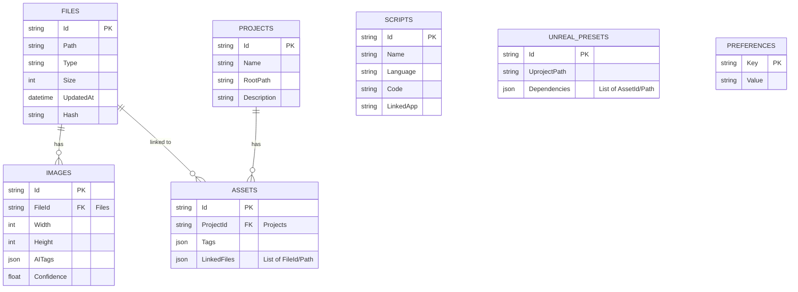

# 📊 Data Structure

このドキュメントでは、Pivotアプリケーションの主要なデータモデル、エンティティ、およびスキーマについて説明します。

## 1. Database Schema with ER Diagram

要件定義書で提示されたテーブル構成を基に、ER図を作成します。



## 2. API Input/Output Data Structures

### 2.1 AI分類結果 (JSON)

`AIClassifierService.AnalyzeAsync` からの出力は、以下のJSON形式を想定しています。

```json
[
  {
    "filePath": "/path/to/image1.png",
    "predictions": [
      { "category": "Texture", "confidence": 0.98 },
      { "category": "Material", "confidence": 0.85 }
    ]
  },
  {
    "filePath": "/path/to/image2.jpg",
    "predictions": [
      { "category": "ConceptArt", "confidence": 0.95 },
      { "category": "Reference", "confidence": 0.70 }
    ]
  }
]
```

### 2.2 SyncService (API連携)

**プロジェクト情報 (POST /projects)**

```json
{
  "id": "guid-string",
  "name": "My Game Project",
  "rootPath": "D:/Projects/MyGame",
  "description": "Description of my game project."
}
```

**WIP情報 (POST /wip)**

```json
{
  "projectId": "guid-string",
  "assetId": "guid-string",
  "progress": 0.75,
  "notes": "Working on character model textures."
}
```

## 3. Persistent vs. Transient Data

- **永続データ (Persistent Data)**:
  - `Files`, `Images`, `Projects`, `Assets`, `Scripts`, `UnrealPresets`, `Preferences` テーブルに格納されるデータは永続的に保存されます。
  - これらのデータはアプリケーションの再起動後も保持され、SQLite/LiteDBによって管理されます。
- **一時データ (Transient Data)**:
  - UIの状態、一時的な計算結果、特定のセッション中にのみ必要なデータなど。これらはメモリ内で管理され、永続化されません。
  - 例: `FileScannerService`のスキャン中の進捗状況、`AIClassifierService`の推論中の結果（キャッシュされるものを除く）。

## 4. Validation and Serialization Rules

- **バリデーション**:
  - **パス**: ファイルパスはOSのパス規則に従い、絶対パスまたは相対パスとして検証されます。
  - **数値**: `Size`, `Width`, `Height`, `Confidence` などの数値フィールドは、適切な範囲と型で検証されます。
  - **JSONデータ**: `AITags`, `Dependencies`, `Tags`, `LinkedFiles` などのJSON形式のデータは、格納前に有効なJSON形式であることを検証します。
  - **必須フィールド**: テーブル定義に従い、必須フィールドが入力されていることを検証します。
- **シリアライゼーション**:
  - **JSON**: API通信および設定保存にはJSON形式を使用します。C#では`System.Text.Json`または`Newtonsoft.Json`を利用してオブジェクトとJSON間のシリアライゼーション/デシリアライゼーションを行います。
  - **DBへの保存**: SQLite/LiteDBへのオブジェクトの保存には、ORM（Object-Relational Mapper）またはMicro-ORM（例: Dapper）を使用し、オブジェクトとデータベースレコード間のマッピングを自動化します。

## 5. Example Object/JSON Representations

上記「API Input/Output Data Structures」および「Database Schema with ER Diagram」のセクションを参照してください。

## 6. Data Flow Between System Layers

1. **UI層**: ユーザー入力（例: ファイル選択、タグ入力）をViewModelに伝達。
2. **ViewModel層**: UIからの入力を受け取り、ビジネスロジックを実行するためにService層のメソッドを呼び出す。Service層から受け取ったデータをViewにバインド可能な形式に変換。
3. **Service層**: 実際のビジネスロジックを実行。`MetadataService`はデータベース操作を行い、`FileScannerService`はファイルシステムを操作、`AIClassifierService`はAI推論を実行する。`SyncService`は外部APIと通信。
4. **Infrastructure層**: `SQLite/LiteDB`はデータの永続化を、`FileSystemWatcher`はファイルシステムイベントを監視、`HttpClient`はWebリクエストを送信、`ONNX Runtime`はAIモデルを実行。

各層は依存性注入を通じて疎結合に保たれ、データは定義されたモデルオブジェクトとして層間を流れます。
